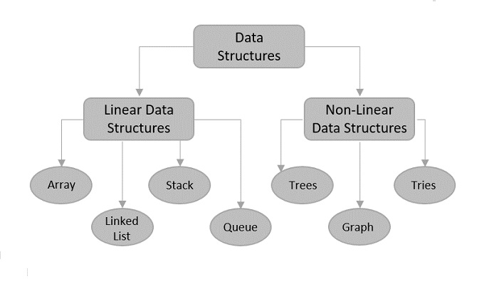

# TTU CSE Data Structures Homework Answers

## Introduction:

資料結構是電腦中儲存資料與組織資料的方式，每一種資料結構都有其特性，而我們必須了解其特性，才能在以後軟體開發中選擇正確的資料結構，一旦選錯，則會大幅影響程式效率與維護，因此學好資料結構對於一個合格的軟體工程師來說是非常重要的課題。


## Data Structures:

  


## Usage:

**Ans folder: 作業答案放置位置**  

**Qs folder: 測資與作業原始檔案放置位置**  

## Download:

**下載壓縮檔或使用git 指令複製到本地端**  


```sh
git clone https://github.com/jerry762/TTU-DS.git
```

## Learning Resources:

<http://alrightchiu.github.io/SecondRound/mu-lu-yan-suan-fa-yu-zi-liao-jie-gou.html>  

<https://web.ntnu.edu.tw/~algo/>

<https://josephjsf2.github.io/>

<https://www.programiz.com/dsa>
